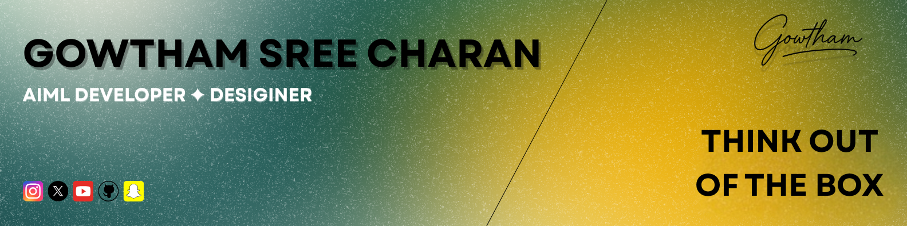

 

# Hi there! 👋

I am [Gowtham](https://gowthamrdyy.vercel.app/),a passionate CSE with AIML student at [SRMIST](https://www.srmist.edu.in/) who loves building things with code. I enjoy learning new technologies, solving problems, and creating content online.  
I mainly work with Python and web technologies like HTML, CSS, and React. I'm currently exploring Web development and AI.
Apart from coding, I'm also a content creator 🎥 — you can find my vlogs and tech videos on YouTube at [@gowthamrdyy](https://www.youtube.com/@gowthamrdyyy).  

---

## Technologies & Languages

                        
 

---

# 📊 GitHub Stats:

---

<picture>
  <source media="(prefers-color-scheme: dark)" srcset="https://raw.githubusercontent.com/gowthamrdyy/gowthamrdyy/output/github-snake-dark.svg" />
  <source media="(prefers-color-scheme: light)" srcset="https://raw.githubusercontent.com/gowthamrdyy/gowthamrdyy/output/github-snake.svg" />
  
</picture>

---

---

## Contact

Want to get in touch?

    
    
    
    
    

