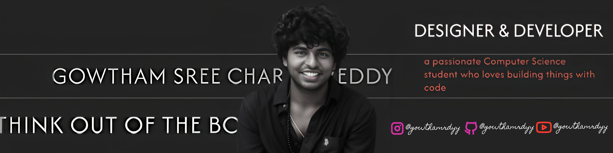

 

# 💫 ABOUT ME:
Hi there! 👋 I'm Gowtham, a passionate Computer Science student who loves building things with code. I enjoy learning new technologies, solving problems, and creating content online.  
I mainly work with Java, Python, and web technologies like HTML, CSS, and React. I'm currently exploring backend development and AI.
Apart from coding, I'm also a content creator 🎥 — you can find my vlogs and tech videos on YouTube at **@gowthamrdyy**.  
I'm always open to learning, collaborating, and connecting with fellow developers!

## 🌐 Socials:
      

# 💻 Tech Stack:
                                  
 

<picture>
  <source media="(prefers-color-scheme: dark)" srcset="https://raw.githubusercontent.com/gowthamrdyy/gowthamrdyy/output/github-snake-dark.svg" />
  <source media="(prefers-color-scheme: light)" srcset="https://raw.githubusercontent.com/gowthamrdyy/gowthamrdyy/output/github-snake.svg" />
  
</picture>

# 📊 GitHub Stats:

### ✍️ Random Dev Quote
 
 

